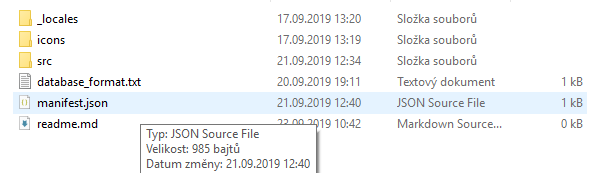
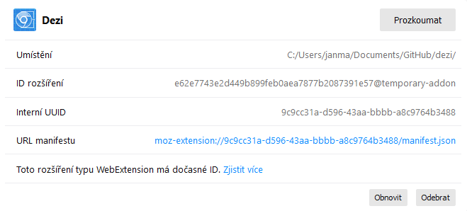

# dezi
Rozšíření pro prohlížeč Google Chrome a Mozilla Firefox, které zobrazuje upozornění při navštívení stránky obsahující dezinformace nebo jiný, potenciálně škodlivý obsah.

## Vývoj
dezi je stále ve vývoji. Není určený k běžnému používání.

## Instalace
Aktuálně je třeba rozšíření instalovat pomocí vývojářských nástrojů. Postup je popsán pro prohlížeč Firefox. Pro Chrome je podobný.

Otevřete menu prohlížeče a vyberte položku **Doplňky**. 

Klikněte na ikonu ozubeného kola a v rozbalovací nabídce vyberte položku **Ladění doplňků**.

Tím se dostanete do vývojářského režimu. Odtud klikněte na tlačítko **Načíst dočasný doplněk**.

Otevře se dialogové okno s výběrem souboru. Najděte umístění doplňku a vyberte soubor **manifest.json**.

Nainstalovaný doplněk vypadá přibližně následovně:

Vedle adresní lišty prohlížeče se objevila ikona rozšíření.
