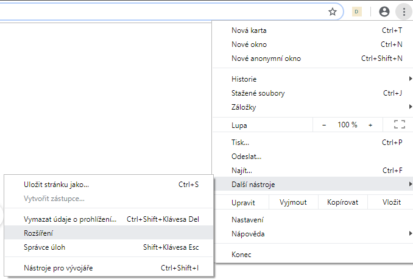
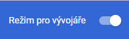
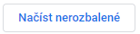

# dezi
Rozšíření pro prohlížeč Google Chrome a Mozilla Firefox, které zobrazuje upozornění při navštívení stránky obsahující
dezinformace nebo jiný, potenciálně škodlivý obsah.

## Vývoj
dezi je stále ve vývoji. Není určený k běžnému používání.

## Instalace
Aktuálně je třeba rozšíření instalovat pomocí vývojářských nástrojů. Postup je popsán pro prohlížeč Chrome. Aktuálně
není totiž možné použít Firefox - hlásí chybu ohledně ID rozšíření.

Nejdříve v menu vyberte **Další nástoje** a odtud **Rozšíření**.



Pokud již není povolen, povolte **Režim pro vývojáře**:



Nakonec klikněte na tlačítko **Načíst nerozbalené** na levé straně a vyberte složku s rozbalenými zdrojovými soubory
rozšíření.



# Dokumentace

Dokumentace je generována příkazem:

```bash
jsdoc src -d "./docs" -r
```

v hlavní složce doplňku.

# Testy

Testy se spouští příkazem:

```bash
node test
```

v hlavní složce doplňku.